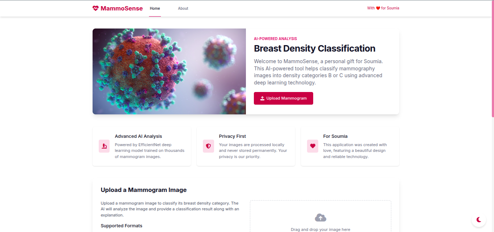
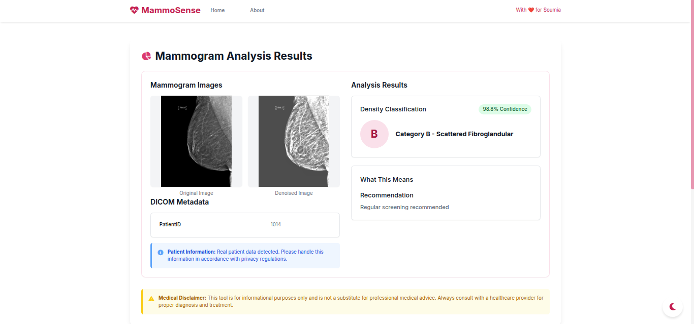

# Mammography Classifier Application


 <!-- Assuming MIT License from LICENSE file -->

**A web application for classifying mammography DICOM images using a DeiT (Data-efficient Image Transformer) model.**

This application provides an interface for uploading DICOM mammograms, viewing them, and obtaining a classification prediction (e.g., Benign/Cancerous or Density categories based on model training) along with a confidence score. It features image enhancement for better visualization.

## Key Features

*   **DICOM Upload & Processing:** Securely upload DICOM (.dcm) files with validation.
*   **Interactive DICOM Viewer:** Integrated viewer (`dicom-viewer.js`) for examining images.
*   **Deep Learning Prediction:** Utilizes a pre-trained DeiT model (`models/best_deit_base_patch16_224_binary_BC.pth`) via PyTorch and `timm`.
*   **Confidence Score:** Displays the model's confidence in its prediction.
*   **Advanced Image Enhancement:** Implements a multi-stage pipeline (`enhance_mammography_dicom` in `src/preprocessing.py`) to improve image clarity for visualization.
*   **Metadata Display:** Shows relevant DICOM metadata extracted during processing.
*   **Web Interface:** Built with Flask, HTML, CSS, and JavaScript.

## Application Screenshots

**1. Main Interface / Prediction Result:**


**2. Results / Viewer View:**


## Model Performance

*(Based on the specific training and validation performed for `best_deit_base_patch16_224_binary_BC.pth`)*

*   **Confusion Matrix:**
    
*   **Accuracy and Loss Curves (Training):**
    

*(Add specific metrics like Accuracy, Precision, Recall, F1-score if available from training logs or `main.ipynb`)*

## Technical Details

*   **Model:** DeiT base (`deit_base_patch16_224.fb_in1k`) loaded using `timm`.
*   **Preprocessing (`src/preprocessing.py`):**
    *   Handles DICOM reading (`pydicom`) and pixel data normalization.
    *   Applies CLAHE for contrast enhancement before model input.
    *   Resizes images to 224x224 and applies PyTorch transforms.
*   **Enhancement (`src/preprocessing.py`):**
    *   Separate pipeline for visualization includes Bilateral Filtering, Non-local Means Denoising, CLAHE, Gamma Correction, Unsharp Masking, etc.
*   **Backend:** Flask framework (`src/app.py`, `src/routes.py`).
*   **Frontend:** HTML (`templates/`), CSS (`static/css/`), JavaScript (`static/js/`).

## Project Structure

```
/
├── .flaskenv               # Flask environment variables
├── .gitignore              # Git ignore rules
├── LICENSE                 # Project License (MIT)
├── main.ipynb              # Jupyter Notebook (likely for model dev/testing)
├── README.md               # This file
├── requirements.txt        # Python dependencies
├── run.py                  # Script to run Flask dev server
├── models/                 # Trained model weights
│   └── best_deit_base_patch16_224_binary_BC.pth # NOTE: Only this model seems present now
├── src/                    # Core application source code
│   ├── __init__.py
│   ├── app.py              # Flask application factory
│   ├── config.py           # Configuration settings
│   ├── models.py           # Model loading & prediction logic
│   ├── preprocessing.py    # Image processing & enhancement
│   ├── routes.py           # Web application routes
│   └── utils.py            # Utility functions
├── static/                 # Static web assets
│   ├── css/
│   ├── js/
│   ├── images/             # UI images, plots
│   └── uploads/            # Default directory for uploads (if used)
└── templates/              # HTML templates
    └── ... (index.html, result.html, etc.)
```

## Installation

1.  **Clone the Repository:**
    ```bash
    git clone <your-repository-url> # Replace with actual URL
    cd rsna-bc-mammo-classifier # Or your directory name
    ```
2.  **Create Virtual Environment (Recommended):**
    ```bash
    python -m venv venv
    source venv/bin/activate  # Linux/macOS
    # .\venv\Scripts\activate  # Windows
    ```
3.  **Install Dependencies:**
    ```bash
    pip install -r requirements.txt
    ```

## Usage

1.  **Run the Development Server:**
    ```bash
    flask run
    ```
2.  Open your web browser and navigate to `http://127.0.0.1:5000` (or the address provided).
3.  Upload a DICOM file using the interface.
4.  View the prediction results, enhanced image, and metadata.

## Contributing

Contributions are welcome. Please follow standard fork-and-pull-request procedures.

## License

This project is licensed under the **MIT License**. See the [LICENSE](LICENSE) file for details.

---
*This README provides an overview of the Mammography Classifier Application.*
